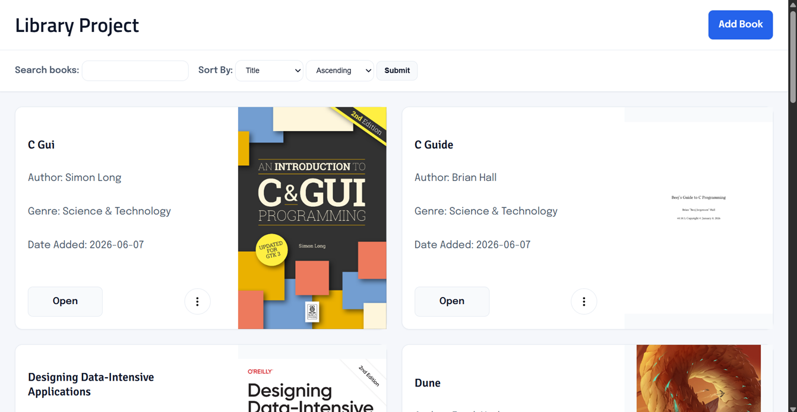
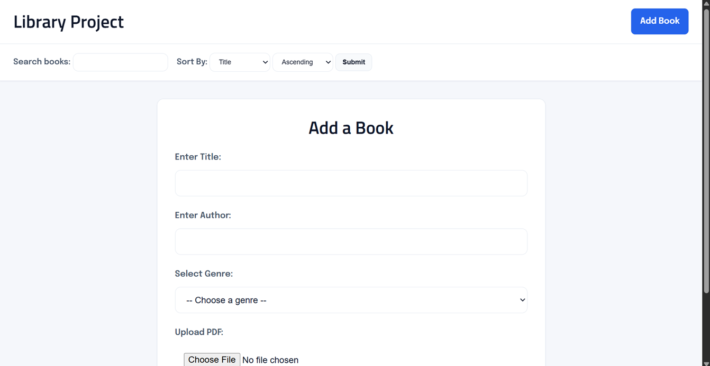
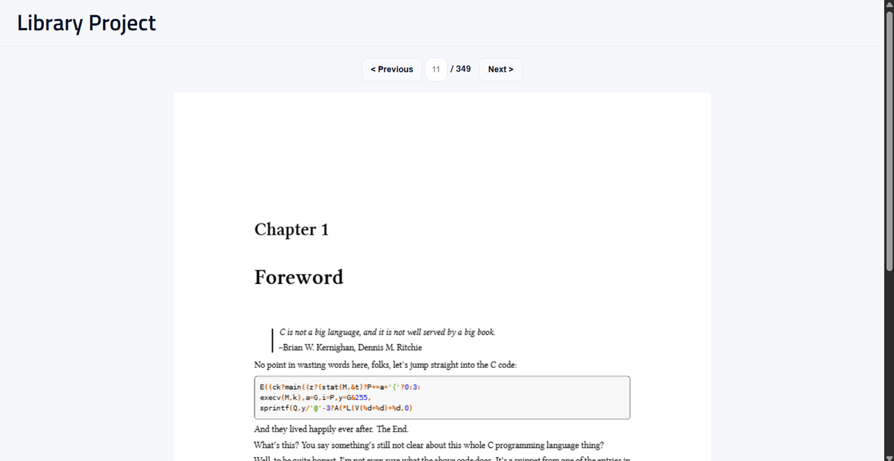
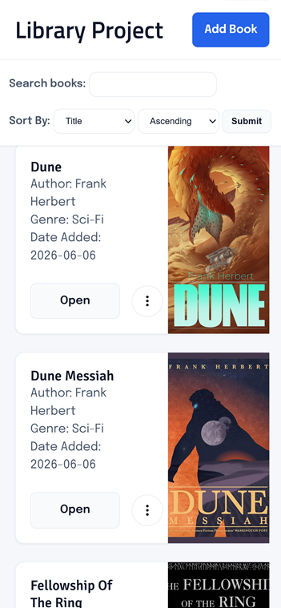
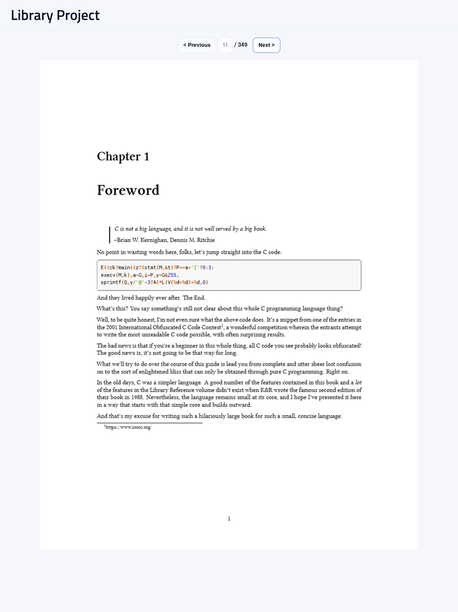

# Library Project
Library Project is a web application for storing and reading book PDFs on a server for a local network or personal device. 
### Features: 
1. Upload books and search your library for specific titles, authors, or genres.  
2. Abilities to add, delete, and update book information.
3. Upload custom book covers for further personalization.
4. View and read book PDFs from any device (including mobile) when hosted openly on a local network.
5. Easy local/offline use when ran directly on personal computer.

## Motivation
I was inspired to make this project when I wanted the ability to digitalize my personal library. After tinkering with a Raspberry Pi, I was motivated to set up a server where I would have the ability to read my store of books from anywhere in my house.

## Built With
* **Backend**: `Sqlite3`, `Flask`, `Python`

* **Frontend**: `HTML`, `CSS`, `JS`

* **PDF Rendering**: `PDF.js`

* **PDF Processing**: `PyMuPDF`

## Getting Started
### 1. Clone the repository into working directory
### 2. Create virtual environment:   
```bash 
python -m venv .venv
```
### 3. Activate virtual environment   

Linux/macOS:   
```bash
source .venv/bin/activate
```   
Windows:
```powershell
.venv\Scripts\activate
```
### 4. Install required modules: 
```bash
pip install -r requirements.txt
```
### 5. Run run.py:
```bash
python run.py
```

To have the database accessible to other devices on the local network and act as a local server, change this line in the run.py file:  
    
```python
app.run(debug=False)
```
to   
```python
app.run(host="0.0.0.0", port=5000, debug=False)
```
This allows other devices on the same local network to access the application, letting other devices access the same library webpage and books.

## Usage
Library Project can be run on a host computer (such as a raspberry pi) for other devices on the network to access or it can be run locally on a single computer.  
Read your favorite books on your laptop, desktop, or even your tablet on your bed.

### Laptop Viewing:







### Mobile View:



### Tablet View:



Note: This project was designed for personal devices or small local networks, it is not designed to be publicly deployed.

### Raspberry Pi Deployment
Using a Raspberry Pi, it is easy to setup Library Project to act as personal library for devices on your local network.  

Steps:
1. Clone the git repository onto the Raspberry Pi, as shown in "Getting Started"
2. Open flask to accept traffic from all devices on the network, as shown in "Getting Started"
3. Start the run.py file directly in terminal or create a `tmux` session to manage the terminal process in the background  

### Future Features
- [x] Upload, search, and delete books
- [x] Built in PDF reader
- [x] Mobile viewing
- [ ] Page Saving
- [ ] Favorite Books
  
  
### Icon Attribution
- This application uses icons from Flaticon: https://www.flaticon.com/uicons